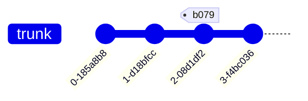
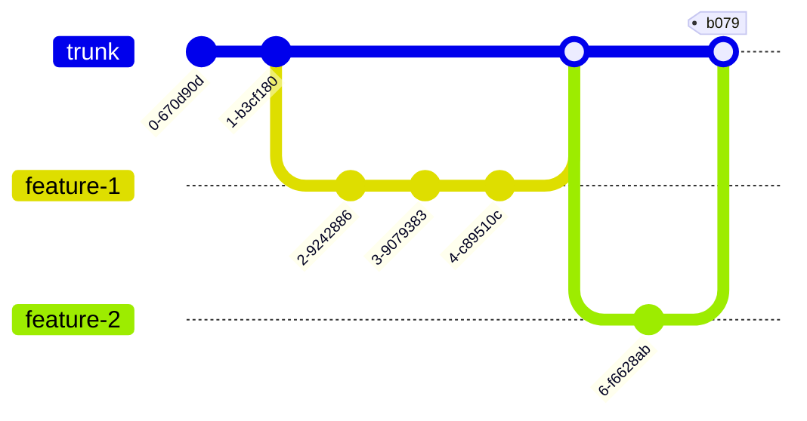
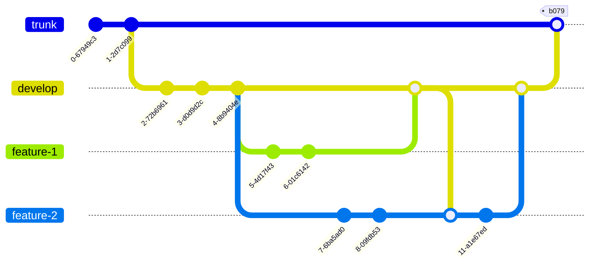

# Very simple naive branching

Trunk is used for releases. All changes are pushed direct to trunk.

This means that trunk may be broken at any time. Commits that are tested and released from are tagged

---
**Note**

This is __not recommended__ on code bases with multiple concurrent features in development. It may work in a micro service with a single commiter that is able to test locally before committing. Generally not a good solution though. 

---

## Feature based strategy. 

This is useful when each feature is released as it is ready. 
If features need to be released in a group, a release tag needs to be applied to trunk for the release

---
**Note**

This is a usual strategy where CI/CD is automated and code is released as it is ready. It should be a target strategy.

---

## Sprint based strategy

When features are grouped arbitrarily (eg by time like a sprint), they can all be merged into a 'develop' branch (name 
is standard for Git workflow branch strategy)

---
**Note**

This is recommended for our current processes in SVN and Git. 

---

