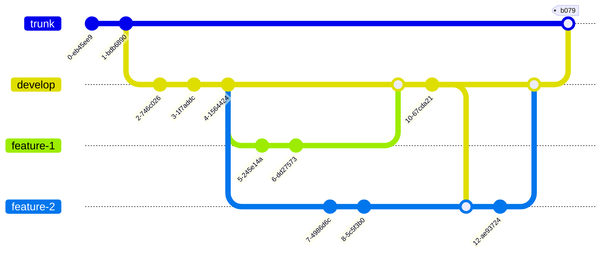

## Very simple naive branching

Trunk is used for releases. All changes are pushed direct to trunk.

This means that trunk may be broken at any time. Commits that are tested and released from are tagged

---
**Note**

This is __not recommended__ on code bases with multiple concurrent features in development. It may work in a micro service with a single commiter that is able to test locally before committing. Generally not a good solution though. 

---

## Feature based strategy. 

This is useful when each feature is released as it is ready. 
If features need to be released in a group, a release tag needs to be applied to trunk for the release

---
**Note**

This is a usual strategy where CI/CD is automated and code is released as it is ready. It should be a target strategy.

---

### Example flow

1. At the start of a Jira task/story, create a feature branch from trunk (eg jira-1234)
2. commit changes for implementing the jira on the branch
3. merge up from trunk (to make sure any other features since merged to trunk are included)
4. test against code built on the branch
5. Code review on code on branch
6. merge to trunk
7. [optional] test trunk build
8. build and deploy from trunk

## Sprint based strategy

When features are grouped arbitrarily (eg by time like a sprint), they can all be merged into a 'develop' branch (name 
is standard for Git workflow branch strategy)

---
**Note**

This is recommended for our current processes in SVN and Git. 

---

### Example flow

Setup by creating a develop branch from trunk.

1. At the start of a Jira task/story, create a feature branch from develop (eg jira-1234)
2. commit changes for implementing the jira on the branch
3. merge up from develop (to make sure any other features since merged to develop are included)
4. test against code built on the branch
5. Code review on code on branch
6. merge to develop
7. test develop build
8. At end of sprint once develop is tested and working, merge to trunk
9. build and deploy from trunk

